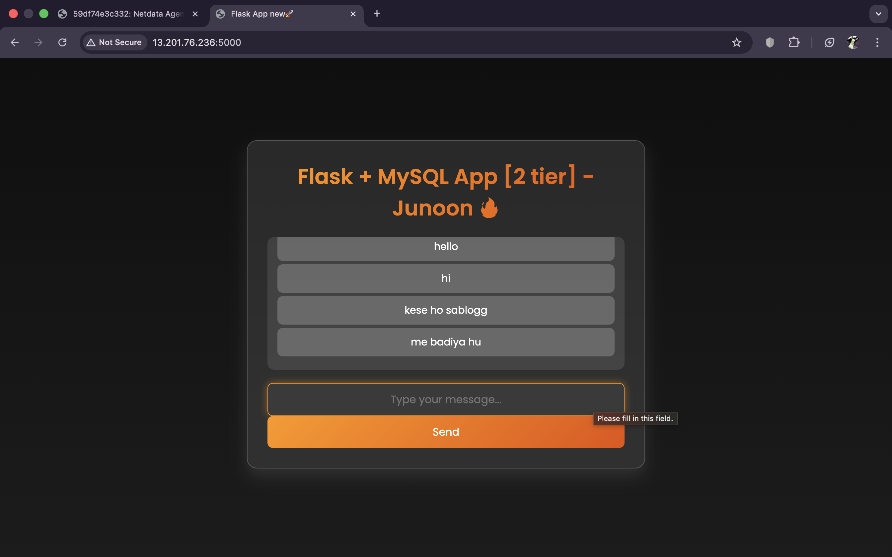
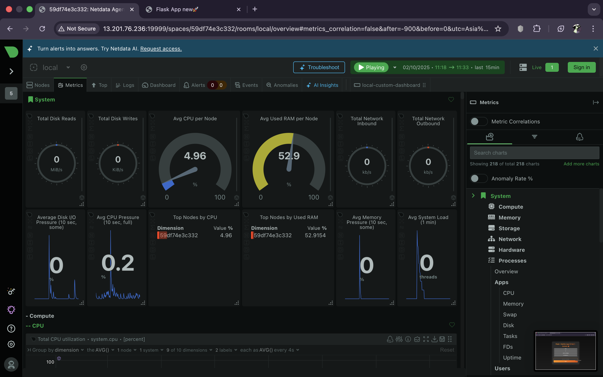
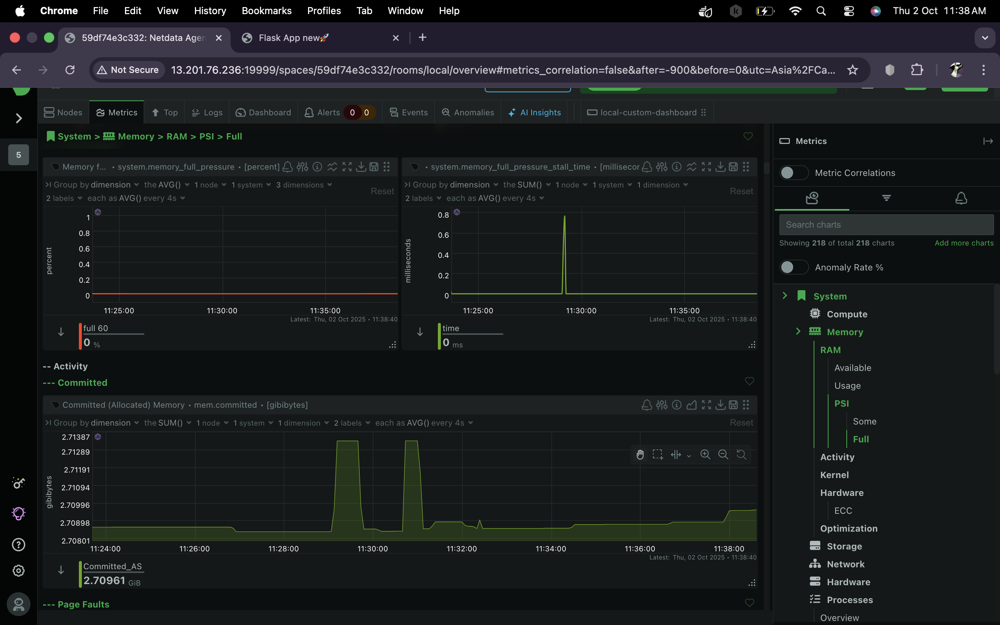

# 📊 Task 7: Monitor System Resources Using Netdata

## 🎯 Objective

Set up **Netdata** to monitor and visualize system resources and application performance metrics in real-time. This will help in understanding lightweight monitoring for servers and applications running in Docker.




---

## 🛠️ Tools Used

* **Netdata** (open-source monitoring & troubleshooting tool)
* **Docker** (to run Netdata containerized)

---

## 🚀 Setup Instructions

### 1. Run Netdata in Docker

```bash
docker run -d --name=netdata -p 19999:19999 netdata/netdata
```

### 2. Access the Dashboard

Open in your browser:

```
http://<server-ip>:19999
```

Example (local machine):
👉 [http://localhost:19999](http://localhost:19999)
    OR
    (Pub_IP:19999)

---


## 📸 Deliverables

* **Screenshot of the Netdata dashboard**
* **Visible metrics** (CPU, RAM, Disk, Docker containers, etc.)





---

## ✅ Outcome

* Successfully installed and ran **Netdata**.
* Gained hands-on experience with **real-time system & app monitoring**.
* Learned how to monitor **Docker containers, server health, and performance metrics**.
